### K8S环境搭建

#### 1. 准备环境

##### 1.1 服务器规划
|  节点名称   | IP  |
|  ----  |  ----  
| k8s-master  | 192.168.10.130  |
| k8s-node01| 192.168.10.131  |
| k8s-node02  | 192.168.10.132 |
> 建议最小硬件配置：2核CPU、2G内存、20G硬盘  
> 服务器最好可以访问 外网，会有从网上拉取镜像需求，如果服务器不能上网，需要提前下载对应镜像并导入节点

##### 1.2 软件环境
|  软件   | 版本  |
|  ----  |  ----  
| OS  | Ubuntu 18.04  |
| Docker | 20.10  |
| Kubernetes  | 1.26 |

##### 1.3 修改主机名
> $ sudo hostnamectl set-hostname  k8s-master   //master节点  
> $ sudo hostnamectl set-hostname  k8s-node01   //node1节点  
> $ sudo hostnamectl set-hostname  k8s-node02   //node1节点   

##### 1.4 添加hosts解析（所有节点）  
> 192.168.10.130 k8s-master m  
> 192.168.10.131 k8s-node01 n1  
> 192.168.10.132 k8s-node02 n2  

##### 1.5 配置免密登录
> 生成私钥和公钥（所有节点）:  
> $ ssh-keygen -t rsa  

> 在集群所有节点执行下面操作（所有节点）:  
> $ ssh-copy-id m  
> $ ssh-copy-id n1  
> $ ssh-copy-id n2 

##### 1.6 关闭交换分区swap(所有节点)  
> $ sudo swapoff  -a  

##### 1.7 禁用防火墙（所有节点）  
> $ sudo ufw disable  

#### 2. Docker安装（所有节点）
> $ sudo apt-get update    

> $ sudo apt-get install \
   apt-transport-https \
   ca-certificates \
   curl \
   gnupg-agent \
   software-properties-common    

> $ curl -fsSL https://download.docker.com/linux/ubuntu/gpg | sudo apt-key add -  

> $ sudo apt-key fingerprint 0EBFCD88    

> $ sudo add-apt-repository \
"deb [arch=amd64] https://download.docker.com/linux/ubuntu \
$(lsb_release -cs) \
stable"  

> $ sudo apt-get update  

> $ sudo apt-get install docker-ce docker-ce-cli containerd.io

#### 3. k8s安装（在所有节点上安装kubectl、kubelet、kubeadm）
> $ sudo apt-get update  
> $ sudo apt-get install -y apt-transport-https  

> $ cat <<EOF >/etc/apt/sources.list.d/kubernetes.list
deb http://apt.kubernetes.io/ kubernetes-xenial main
EOF  

> $ sudo apt-get update  
> $ sudo apt-get install -y kubectl kubelet kubeadm

#### 4. 初始化master节点
> k8s.gcr.io可以访问的情况下可以直接执行init：  
> $ kubeadm init --pod-network-cidr=10.244.0.0/16    

> $ mkdir -p $HOME/.kube  

> $ sudo cp -i /etc/kubernetes/admin.conf $HOME/.kube/config  

> $ sudo chown $(id -u):$(id -g) $HOME/.kube/config  

#### 5. 安装pod网络插件flannel(Master节点)  
> $ cd /etc/kubernetes/manifests  
> $ sudo wget https://raw.githubusercontent.com/coreos/flannel/master/Documentation/kube-flannel.yml  
> $ kubectl apply -f kube-flannel.yml  

> 可选：如果由于国内墙的原因，kubelet可能无法拉取flannel镜像，需要手动执行命令拉取：  
> $ sudo docker pull quay.io/coreos/flannel:v0.15.1-amd64    
> 然后再执行：  
> $ kubectl apply -f kube-flannel.yml  

> 查看状态:
> $ kubectl get pod -n kube-system
> 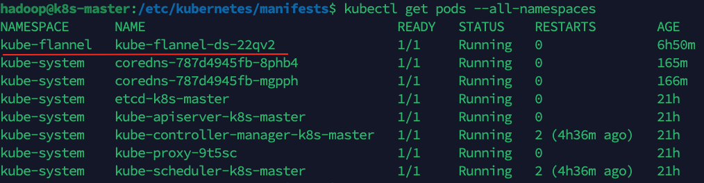  
> 上图所示表明安装成功

#### 6. 添加node工作节点(Node节点)   
> 查看master节点初始化成功后的token：  
> $ kubeadm token list  

> 重新生成token（默认 token 的有效期为 24 小时。当过期之后，该 token 就不可用了），可以执行如下命令重新生成：  
> $ kubeadm token create  
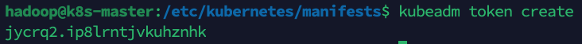  

> 获取CA证书的HASH值：  
> $ openssl x509 -pubkey -in /etc/kubernetes/pki/ca.crt | openssl rsa -pubin -outform der 2>/dev/null | openssl dgst -sha256 -hex | sed 's/^.* //'     
  
 
> 执行添加node命令：  
> $ sudo kubeadm join 192.168.10.130:6443 --token jycrq2.ip8lrntjvkuhznhk \
--discovery-token-ca-cert-hash sha256:dbaa50f1a486c94e2b648a0d1ab9f0a15ff081686f83514dedc75ea731680b9a

> 查看状态：  
> $ kubectl get nodes   
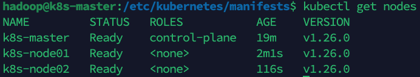  
> $ kubectl get pods --all-namespaces  
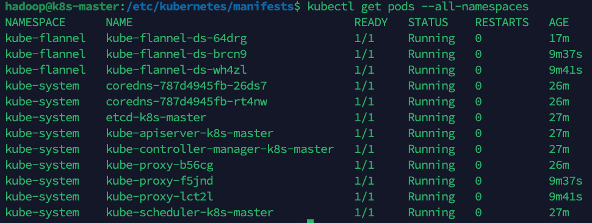  

#### 7. 安装Dashboard（Master节点）  
> 部署命令：  
> $ kubectl apply -f https://raw.githubusercontent.com/kubernetes/dashboard/v2.7.0/aio/deploy/recommended.yaml  

> $ kubectl get pods -A  
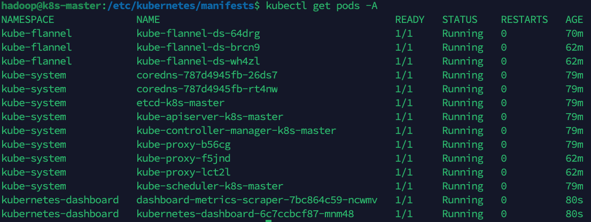  
> 部署成功后，可以看到kubernetes-dashboard相关的两个pods  
> 
> $ kubectl get services -A  
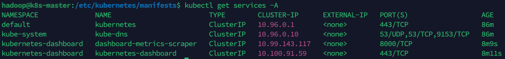   
> 以及和kubernetes-dashboard相关的两个services

#### 8. 访问dashboard  
> 参考官方文章： https://github.com/kubernetes/dashboard/blob/master/docs/user/accessing-dashboard/README.md  

> 当前集群信息如下:  
> $ kubectl cluster-info
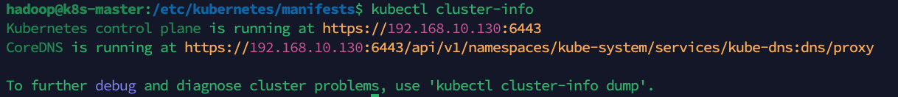  

> $ kubectl -n kubernetes-dashboard edit service kubernetes-dashboard  
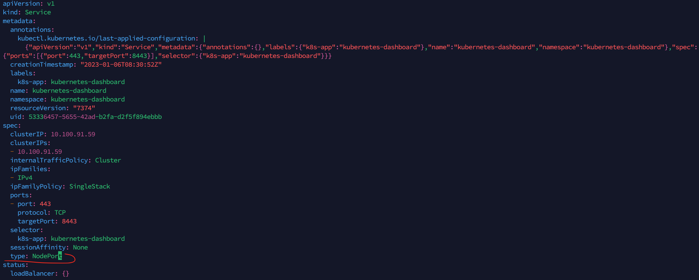  
> 修改type: ClusterIP 为 type: NodePort:

> 查看具体分配的 node port：  
> $ kubectl -n kubernetes-dashboard get service kubernetes-dashboard  
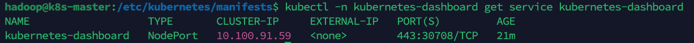   
> 可以看到这里分配的是 30708 端口

> 查看kubernetes-dashboard 服务被部署到了哪个节点：  
> $ kubectl get pods -A -o wide | grep kubernetes-dashboard  
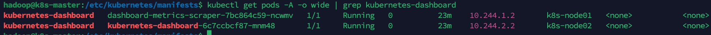  
> 如图 kubernetes-dashboard 服务被部署到了 k8s-node2 节点，k8s-node2 的 IP 是 192.168.10.132，则拼合起来的地址是:
> https://192.168.10.132:30708  

##### 8.1 通过token登录  
> 创建 Dashboard 的 Service Account：  
> $ kubectl create serviceaccount dashboard-admin-user -n kubernetes-dashboard  

> 查看 Dashboard 的 Service Account：  
> $ kubectl get serviceaccount -n kubernetes-dashboard | grep dashboard-admin-user  

> 创建ClusterRoleBinding   
> $ kubectl create clusterrolebinding dashboard-cluster-admin --clusterrole=cluster-admin --serviceaccount=kubernetes-dashboard:dashboard-admin-user  

> 查看ClusterRoleBinding    
> $ kubectl get clusterrolebinding -n kubernetes-dashboard|grep dashboard-cluster-admin  

> 创建token：  
> $ kubectl -n kubernetes-dashboard create token dashboard-admin-user  
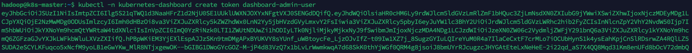  

> 删除ServiceAccount and ClusterRoleBinding：  
> $ kubectl -n kubernetes-dashboard delete serviceaccount dashboard-admin-user   
> $ kubectl -n kubernetes-dashboard delete clusterrolebinding dashboard-admin-user 

##### 8.2 通过kubeconf文件登录  
> 在 kebeconf 文件（路径为 ~/.kube/config）中加入 token 信息  
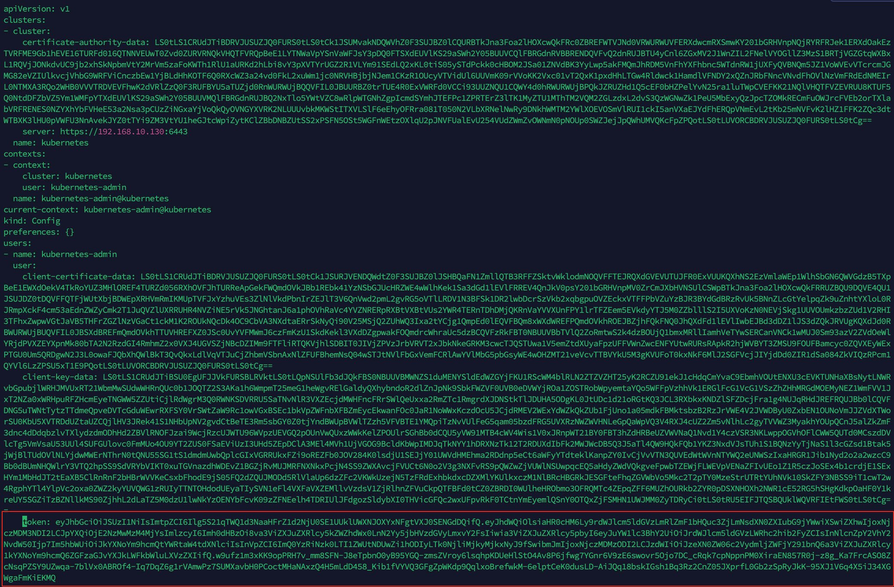
