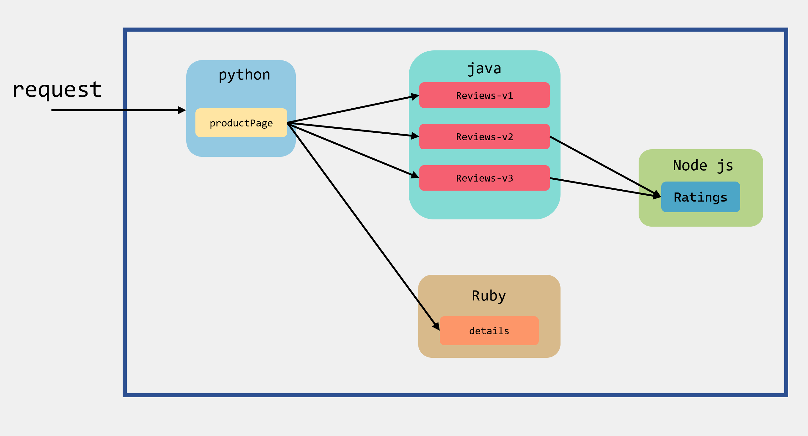

### Istio部署  
> 以下内容基于kubernetes 1.26 部署，请先准备好k8s平台。  

#### 1. 下载Istio  
> $ curl -L https://istio.io/downloadIstio | ISTIO_VERSION=1.16.1 TARGET_ARCH=x86_64 sh -

解压好之后里面会包含如下文件目录:

|  目录   | 包含内容  |
|  ----  |  ----  
| bin  | istioctl执行程序  |
| samples | 示例应用程序  |
| tools  | 用于性能测试和在本地机器上进行测试的脚本 |
| manifests  | istio相关的主要部署组件 |
| manifest.yaml  | 当前istio版本中manifests目录下各组件的配置和依赖描述 |
   

> 将istioctl客户端路径加入环境变量:  
> $ export PATH=$PWD/bin:$PATH  

> 查看 istio 环境以及版本信息：  
> $ istioctl version  
> 

> 查看内置的配置文件  
> $ istioctl profile list  
> 

|  配置文件   | 核心组件  | 说明  |
|  ----  |  ----  |  ----
| default  | istio-ingressgateway、istiod  | 根据 IstioOperator API 的默认设置启动组件。可用于生产部署  |
| demo | istio-egressgateway、istio-ingressgateway、istiod  | 展示 Istio 的功能，启用了高级别的追踪和访问日志（需要具有适度的资源），适合学习使用  |
| minimal  | istiod | 与默认配置文件相同，但只安装了控制平面组件  |
| remote  | - | 配置 Multicluster Mesh 的 Remote Cluster  |
| empty  | - | 不部署任何东西。可以作为自定义配置的基本配置文件  |
| preview  | istio-ingressgateway、istiod | 实验性。用于探索 Istio 的新功能。不确保稳定性、安全性和性能  |  

### 2. 安装
> 我们这里用于学习使用，所以使用demo进行安装  
> $ istioctl manifest apply --set profile=demo  
>   
> 安装好之后会生成一个新的namespace：istio-system  
>   
> 
> 指定ns来获取它下面的pod  
> $ kubectl get pod -n istio-system  
>   

> 查看 Istio 在 Kubernetes 部署了什么  
> $ kubectl -n istio-system get deploy  
>   

### 3. Bookinfo 示例
Bookinfo 是 Istio 社区官方推荐的示例应用之一。它可以用来演示多种Istio的特性，并且它是一个异构的微服务应用。应用由四个单独的微服务构成：productpage、details、reviews、ratings。
- productpage 调用 details 和 reviews 两个微服务，用来生成页面，由python编写。
- details 包含了书籍的信息由，Ruby来编写。
- reviews 包含了书籍相关的评论。它还会调用 ratings 微服务，由java编写。
- ratings 包含了由书籍评价组成的评级信息，由Node js编写。

> 下面这个图展示了调用关系  
>   
reviews微服务有3个版本:  
-v1版本不会调用ratings服务  
-v2版本会调用ratings服务，并使用1到5个黑色星形图标来显示评分信息  
-v3版本会调用ratings服务，并使用1到5个红色星形图标来显示评分信息  

如果我们的应用要接入Istio服务，那么就需要在这些应用里面都打上sidecar，使服务所有的出入流量都被sidecar所劫持，然后就可以利用istio为应用提供服务路由、遥测数据收集以及策略实施等功能  

### 4. 启动服务
> 为了下面示例项目的演示，我们先准备一个命名空间 istio-app  
> $ kubectl create ns istio-app  
> 
> 为istio-app命名空间打上istio-injection=enabled标签，Istio自动注入Sidecar  
> $ kubectl label ns istio-app istio-injection=enabled  
>    

> 部署Bookinfo  
> $ kubectl apply -n istio-app -f samples/bookinfo/platform/kube/bookinfo.yaml  
>    

> 过一段时间后确认应用都已启动和部署成功  
> $ kubectl get pod -n istio-app  
>    

> 用describe命令查看其中的pod  
> $ kubectl describe pod details-v1-6997d94bb9-vbzkd -n istio-app  

> 为了能让应用程序可以从外部访问 k8s 集群，需要安装gateway  
> $ kubectl apply -n istio-app -f samples/bookinfo/networking/bookinfo-gateway.yaml  
> 
> 确认网关创建完成  
> $ kubectl get gateway -n istio-app  
> $ kubectl get svc -n=istio-system  
>     

> 由于未使用外部负载均衡器，需要通过 node port 访问，将istio-ingressgateway Service的Type修改为NodePort  
> $ kubectl edit svc istio-ingressgateway -n=istio-system  
>    

#### 5. 访问Bookinfo应用
> $ kubectl get svc -n=istio-system  
>    
> 
> 查看 bookinfo 应用部署在那个 k8s node
> $ kubectl get pods -A -o wide|grep istio-app  
>     
> 
> 根据NodePort和NodeIP得到外部可访问的IP：http://192.168.10.131:31486/productpage  
>     
> 多次刷新页面将会看到reviews不同的版本  

#### 6. 安装Kiali和其他插件  
> $ kubectl apply -f samples/addons  
>   
> 
> 确认所有Pod正常启动  
> $ kubectl get pod -n istio-system  
>    
> 
> $ kubectl get svc -n istio-system   
>    

> 将kiali Service的Type修改为NodePort：  
> $ kubectl edit svc kiali -n istio-system  
> 
> 查看kiali Service的Type是否修改成功  
> $ kubectl get svc -n istio-system  
>   

>   
> Kiali访问URL：  
> http://192.168.10.131:31181（使用对应的NodeIp和NodePort）  
>   

